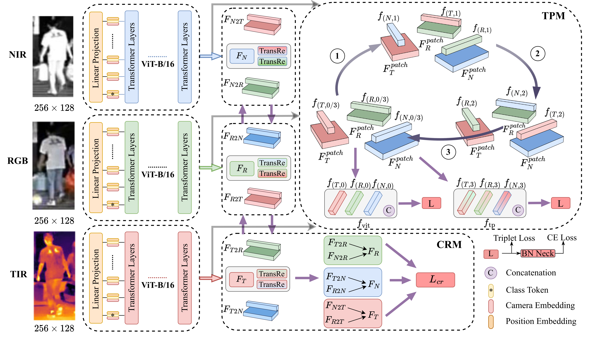

# TOP-ReID: Multi-spectral Object Re-Identification with Token Permutation



**TOP-ReID** is a powerful multi-spectral object Re-identification (ReID) framework designed to retrieve specific objects by leveraging complementary information from different image spectra. It overcomes the limitations of traditional single-spectral ReID in complex visual environments by reducing distribution gap and enhancing cyclic feature aggregation among different image spectra. Besides, TOP-ReID achieves advanced performance in multi-spectral and missing-spectral object ReID and holds great potential under cross-spectral settings.

## News
Exciting news! Our paper has been accepted by the AAAI 2024! 🎉

## Table of Contents

- [Introduction](#introduction)
- [Contributions](#contributions)
- [Results](#results)
- [Visualizations](#visualizations)
- [Reproduction](#reproduction)
- [Citation](#citation)


## Introduction

Multi-spectral object ReID is crucial in scenarios where objects are captured through different image spectra, such as RGB, near-infrared, and thermal imaging. **TOP-ReID** tackles the challenges posed by the distribution gap among these spectra and enhances feature representations by utilizing all tokens of Transformers.

## Contributions

- We propose a novel feature learning framework named TOP-ReID for multi-spectral object ReID. To our best knowledge, our proposed TOP-ReID is the first work to utilize all the tokens of vision Transformers to improve the multi-spectral object ReID.
- We propose a Token Permutation Module (TPM) and a Complementary Reconstruction Module (CRM) to facilitate multi-spectral feature alignment and handle spectral-missing problems effectively.
- We perform comprehensive experiments on three multispectral object ReID benchmarks, i.e., RGBNT201, RGBNT100 and MSVR310. The results fully verify the effectiveness of our proposed methods.

## Results
### Multi-spectral Object ReID
#### Multi-spectral Person ReID [RGBNT201]


#### Multi-spectral Vehicle ReID [RGBNT100、MSVR310]
  

### Missing-spectral Object ReID
#### Missing-spectral Person ReID [RGBNT201]
  

#### Missing-spectral Vehicle ReID [RGBNT100]
  

### Performance comparison with different modules [RGBNT201、RGBNT100]

  

### Performance comparison of different backbones [RGBNT201]


## Visualizations
### T-SNE [RGBNT201]


### Grad-CAM [RGBNT201、RGBNT100]


#### Please check the paper for detailed information

## Reproduction
### Datasets
RGBNT201    link: https://drive.google.com/drive/folders/1EscBadX-wMAT56_It5lXY-S3-b5nK1wH  
RGBNT100    link: https://pan.baidu.com/s/1xqqh7N4Lctm3RcUdskG0Ug  code：rjin  
MSVR310     link: https://pan.baidu.com/s/1QyZUkbvpZ3U4d0iPt4IfVA  code:msvr

### Pretrained
ViT-B    link: https://pan.baidu.com/s/1YE-24vSo5pv_wHOF-y4sfA  
DeiT-S      link: https://pan.baidu.com/s/1YE-24vSo5pv_wHOF-y4sfA  
T2T-ViT-24  link: https://pan.baidu.com/s/1YE-24vSo5pv_wHOF-y4sfA

### Configs
RGBNT201    file: `TOP-ReID/configs/RGBNT201/TOP-ReID.yml`  
RGBNT100    file: `TOP-ReID/configs/RGBNT100/TOP-ReID.yml`  
MSVR310     file: `TOP-ReID/configs/MSVR310/TOP-ReID.yml`
 
### Bash
```bash
#!/bin/bash
source activate (your env)
cd ../(your path)
pip install -r requirements.txt
python train_net.py --config_file ../RGBNT201/TOP-ReID.yml
```
### Training Example
In order to facilitate users in reproducing the results, we have provided training example. It is important to note that there may be slight variations in the experimental results compared to the data presented in the paper. It is worth noting that our model shows significant improvements on the RGBNT201 dataset. This is partly related to the dataset itself and partly to our choice of learning rate. During the experimental process, to align with the learning rate settings in TransReID, we initially adjust the learning rate to 0.008. However, we find that this task is sensitive to the learning rate. When the learning rate is too low, the model's performance fluctuates significantly. Therefore, for better performance and to enhance the competitiveness of our model, we choose a uniform and more suitable learning rate, ultimately selecting 0.009 as the standardized experimental setting. On the smaller MSVR310 dataset, we follow the authors' recommendations, using a higher number of epochs to improve the model's performance. Please note the above details. Here is the example of training TOP-ReID on RGBNT201 and RGBNT100.

#### RGBNT201:  
[train.txt](train_RGBNT201.txt)
#### RGBNT100:  
[train.txt](train_RGBNT100.txt)

## Citation
If you find TOP-ReID useful in your research, please consider citing:
```bibtex
@inproceedings{wang2024topreid,
  title={TOP-ReID: Multi-spectral Object Re-Identification with Token Permutation},
  author={Wang, Yuhao; Liu, Xuehu; Zhang, Pingping; Lu, Hu; Tu Zhengzheng and Lu, Huchuan},
  booktitle={AAAI},
  year={2024}
}
